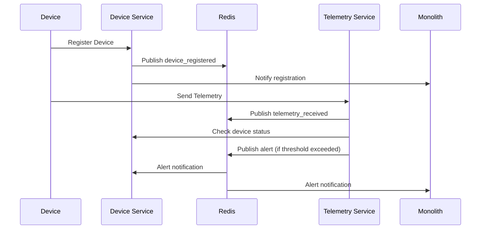

# Задание 6. Разработка MVP - Реализация

## Обзор

В рамках Task 6 была успешно реализована MVP архитектура микросервисов для системы "Тёплый дом", включающая:

1. **Device Management Service** (Java/Spring Boot) - управление IoT устройствами
2. **Telemetry Service** (Python/FastAPI) - обработка телеметрических данных
3. **Message Broker Integration** (Redis) - асинхронная коммуникация
4. **Database per Service** - изолированные базы данных для каждого сервиса

## Архитектура MVP

### Компоненты системы

```
┌─────────────────┐    ┌─────────────────┐    ┌─────────────────┐
│   Monolith      │    │ Device Service  │    │Telemetry Service│
│   (Go/Gin)      │    │ (Java/Spring)   │    │ (Python/FastAPI)│
│   Port: 8080    │    │   Port: 8081    │    │   Port: 8082    │
└─────────────────┘    └─────────────────┘    └─────────────────┘
         │                       │                       │
         └───────────────────────┼───────────────────────┘
                                 │
                    ┌─────────────────┐
                    │     Redis       │
                    │ Message Broker  │
                    │   Port: 6379    │
                    └─────────────────┘
```

### Базы данных

- **PostgreSQL (Main)** - основная база данных монолита
- **PostgreSQL (Device)** - база данных Device Service
- **InfluxDB** - временные ряды для телеметрии
- **Redis** - кэширование и pub/sub

## Device Management Service

### Технологический стек
- **Framework**: Spring Boot 3.2
- **Language**: Java 21
- **Database**: PostgreSQL
- **Message Broker**: Redis
- **Build Tool**: Maven

### Ключевые компоненты

#### 1. Domain Models
- [`Device.java`](../apps/device-service/src/main/java/com/smarthome/deviceservice/model/Device.java) - основная модель устройства
- [`DeviceCommand.java`](../apps/device-service/src/main/java/com/smarthome/deviceservice/model/DeviceCommand.java) - модель команд устройства

#### 2. Repository Layer
- [`DeviceRepository.java`](../apps/device-service/src/main/java/com/smarthome/deviceservice/repository/DeviceRepository.java) - репозиторий устройств
- [`DeviceCommandRepository.java`](../apps/device-service/src/main/java/com/smarthome/deviceservice/repository/DeviceCommandRepository.java) - репозиторий команд

#### 3. Service Layer
- [`DeviceService.java`](../apps/device-service/src/main/java/com/smarthome/deviceservice/service/DeviceService.java) - бизнес-логика
- [`MessageService.java`](../apps/device-service/src/main/java/com/smarthome/deviceservice/service/MessageService.java) - интеграция с Redis

#### 4. REST API
- [`DeviceController.java`](../apps/device-service/src/main/java/com/smarthome/deviceservice/controller/DeviceController.java) - REST контроллер

### API Endpoints

```http
# Device Management
POST   /api/v1/devices                    # Register device
GET    /api/v1/devices/{id}               # Get device
PUT    /api/v1/devices/{id}               # Update device
DELETE /api/v1/devices/{id}               # Delete device
GET    /api/v1/devices                    # List devices with filters

# Device Commands
POST   /api/v1/devices/{id}/commands      # Send command
GET    /api/v1/devices/{id}/commands      # Get device commands
PATCH  /api/v1/devices/{id}/commands/{cmdId}/acknowledge  # Acknowledge command
PATCH  /api/v1/devices/{id}/commands/{cmdId}/complete     # Complete command

# Device Status
PATCH  /api/v1/devices/{id}/status        # Update device status
GET    /api/v1/devices/search             # Search devices
GET    /api/v1/devices/low-battery        # Get low battery devices
GET    /api/v1/devices/offline            # Get offline devices
```

## Telemetry Service

### Технологический стек
- **Framework**: FastAPI
- **Language**: Python 3.11
- **Database**: InfluxDB (time-series)
- **Message Broker**: Redis
- **Package Manager**: pip

### Ключевые компоненты

#### 1. Data Models
- [`telemetry.py`](../apps/telemetry-service/app/models/telemetry.py) - модели телеметрических данных

#### 2. Database Clients
- [`influxdb.py`](../apps/telemetry-service/app/database/influxdb.py) - клиент InfluxDB
- [`redis_client.py`](../apps/telemetry-service/app/database/redis_client.py) - клиент Redis

#### 3. Services
- [`telemetry_service.py`](../apps/telemetry-service/app/services/telemetry_service.py) - основной сервис
- [`message_consumer.py`](../apps/telemetry-service/app/services/message_consumer.py) - обработчик сообщений

#### 4. FastAPI Application
- [`main.py`](../apps/telemetry-service/app/main.py) - основное приложение

### API Endpoints

```http
# Telemetry Data
POST   /api/v1/telemetry                  # Store telemetry data
POST   /api/v1/telemetry/batch            # Store batch telemetry
GET    /api/v1/telemetry/{deviceId}       # Query telemetry data
GET    /api/v1/telemetry/{deviceId}/latest # Get latest telemetry
GET    /api/v1/telemetry/{deviceId}/aggregated # Get aggregated data
DELETE /api/v1/telemetry/{deviceId}       # Delete telemetry data

# Alerts
GET    /api/v1/devices/{deviceId}/alerts  # Get device alerts

# Health
GET    /health                            # Health check
```

## Message Broker Integration

### Redis Channels

1. **device.events** - события устройств
2. **telemetry.data** - телеметрические данные
3. **alerts.notifications** - уведомления об алертах

### Event-Driven Communication



## Docker Configuration

### Services в docker-compose.yml

```yaml
services:
  # Databases
  postgres:           # Main database
  device-postgres:    # Device service database
  influxdb:          # Telemetry time-series database
  redis:             # Message broker and cache
  
  # Microservices
  device-service:    # Device management (Java/Spring Boot)
  telemetry-service: # Telemetry processing (Python/FastAPI)
  
  # Legacy
  temperature-api:   # Legacy temperature API (Go/Gin)
  app:              # Main monolith application (Go/Gin)
  
  # Monitoring (optional)
  redis-commander:   # Redis web UI
```

### Ports Mapping

- **8080** - Main Application (Monolith)
- **8081** - Device Service
- **8082** - Telemetry Service
- **8083** - Temperature API (Legacy)
- **5432** - PostgreSQL (Main)
- **5433** - PostgreSQL (Device Service)
- **8086** - InfluxDB
- **6379** - Redis

## Integration Patterns

### 1. Strangler Fig Pattern
Постепенная миграция функциональности из монолита в микросервисы:

```
Monolith → Device Service (device management)
Monolith → Telemetry Service (telemetry processing)
```

### 2. Database per Service
Каждый микросервис имеет собственную базу данных:

- Device Service → PostgreSQL (device_service_db)
- Telemetry Service → InfluxDB (telemetry bucket)
- Monolith → PostgreSQL (smarthome)

### 3. Event-Driven Architecture
Асинхронная коммуникация через Redis pub/sub:

- Device events
- Telemetry data streams
- Alert notifications

### 4. API Gateway Pattern
Монолит выступает в роли API Gateway для внешних клиентов.

## Конфигурация и Deployment

### Environment Variables

#### Device Service
```bash
SPRING_PROFILES_ACTIVE=docker
DB_USERNAME=device_user
DB_PASSWORD=device_password
REDIS_HOST=redis
MONOLITH_URL=http://app:8080
TELEMETRY_SERVICE_URL=http://telemetry-service:8082
```

#### Telemetry Service
```bash
INFLUXDB_URL=http://influxdb:8086
INFLUXDB_TOKEN=telemetry-token
INFLUXDB_ORG=smart-home
INFLUXDB_BUCKET=telemetry
REDIS_HOST=redis
DEVICE_SERVICE_URL=http://device-service:8081
```

### Health Checks
Все сервисы имеют health check endpoints:

- Device Service: `/device-service/actuator/health`
- Telemetry Service: `/health`
- InfluxDB: `influx ping`
- Redis: `redis-cli ping`

## Мониторинг и Observability

### Metrics
- **Prometheus** metrics endpoints
- **Spring Boot Actuator** для Device Service
- **FastAPI** metrics для Telemetry Service

### Logging
- **Structured logging** с JSON форматом
- **Centralized logging** через Docker logs
- **Log levels** настраиваются через environment variables

### Health Monitoring
- **Health checks** для всех сервисов
- **Dependency checks** в docker-compose
- **Graceful shutdown** handling

## Тестирование

### Unit Tests
- Device Service: JUnit 5 + Mockito
- Telemetry Service: pytest + pytest-asyncio

### Integration Tests
- Database integration tests
- Redis pub/sub tests
- API endpoint tests

### End-to-End Tests
- Docker Compose environment
- Postman collection для API тестирования

## Безопасность

### Authentication & Authorization
- JWT tokens (планируется)
- Service-to-service authentication
- Database credentials через environment variables

### Network Security
- Internal Docker network
- Port exposure только для необходимых сервисов
- Health check endpoints protection

### Data Security
- Database encryption at rest
- Secure Redis configuration
- Sensitive data через environment variables

## Performance Considerations

### Scalability
- Horizontal scaling готовность
- Database connection pooling
- Redis connection pooling
- Async processing в Telemetry Service

### Caching
- Redis caching для frequently accessed data
- Application-level caching
- Database query optimization

### Resource Management
- Memory limits в Docker
- CPU limits configuration
- Database connection limits

## Следующие шаги

1. **Интеграция с монолитом** - обновление монолита для использования новых микросервисов
2. **API Gateway** - внедрение dedicated API Gateway (Kong, Nginx)
3. **Service Discovery** - Consul или Eureka для service discovery
4. **Configuration Management** - централизованная конфигурация
5. **Distributed Tracing** - Jaeger или Zipkin
6. **Circuit Breaker** - Hystrix или Resilience4j
7. **Load Balancing** - HAProxy или Nginx load balancer

## Заключение

MVP архитектура микросервисов успешно реализована с использованием:

- ✅ **Device Management Service** (Java/Spring Boot)
- ✅ **Telemetry Service** (Python/FastAPI)  
- ✅ **Message Broker Integration** (Redis)
- ✅ **Database per Service Pattern**
- ✅ **Event-Driven Architecture**
- ✅ **Docker Containerization**
- ✅ **Health Monitoring**
- ✅ **Structured Logging**

Система готова для дальнейшего развития и масштабирования в полноценную микросервисную архитектуру.